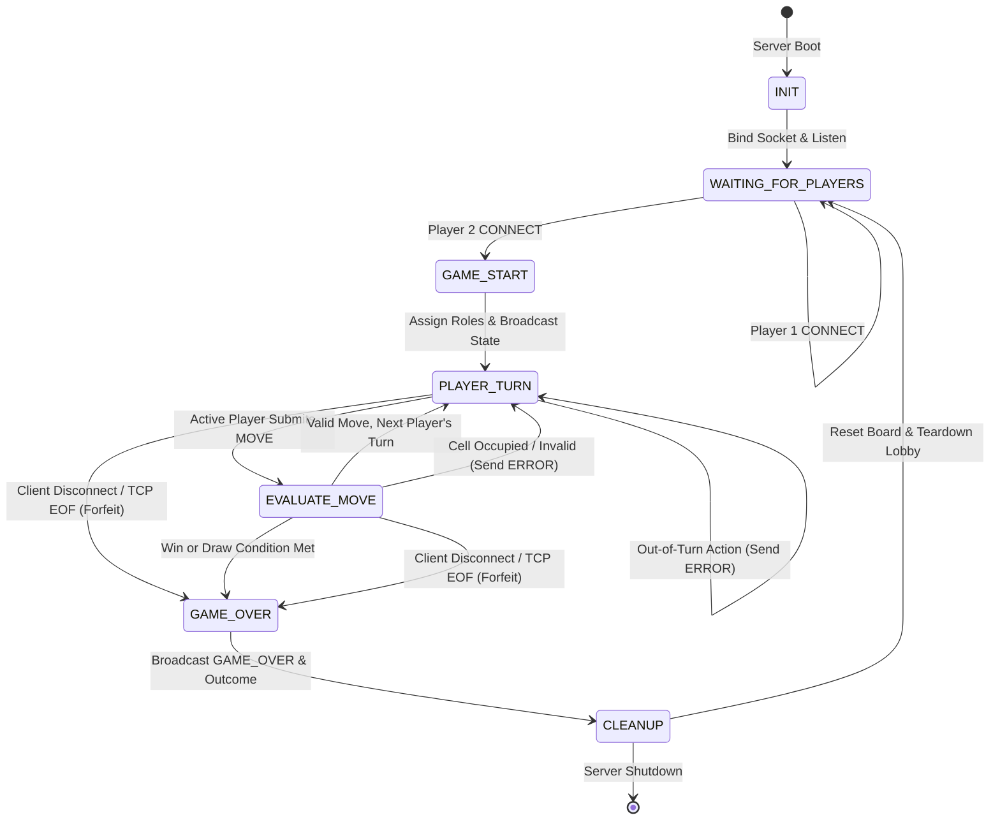

# Server-Side Finite State Machine (FSM)

```mermaid
stateDiagram-v2
    [*] --> INIT : Server Boot
    INIT --> WAITING_FOR_PLAYERS : Bind Socket & Listen
    WAITING_FOR_PLAYERS --> WAITING_FOR_PLAYERS : Player 1 CONNECT
    WAITING_FOR_PLAYERS --> GAME_START : Player 2 CONNECT
    GAME_START --> PLAYER_TURN : Assign Roles & Broadcast State
    PLAYER_TURN --> EVALUATE_MOVE : Active Player Submits MOVE
    PLAYER_TURN --> PLAYER_TURN : Out-of-Turn Action (Send ERROR)
    PLAYER_TURN --> GAME_OVER : Client Disconnect / TCP EOF (Forfeit)
    EVALUATE_MOVE --> PLAYER_TURN : Valid Move, Next Player's Turn
    EVALUATE_MOVE --> PLAYER_TURN : Cell Occupied / Invalid (Send ERROR)
    EVALUATE_MOVE --> GAME_OVER : Win or Draw Condition Met
    EVALUATE_MOVE --> GAME_OVER : Client Disconnect / TCP EOF (Forfeit)
    GAME_OVER --> CLEANUP : Broadcast GAME_OVER & Outcome
    CLEANUP --> WAITING_FOR_PLAYERS : Reset Board & Teardown Lobby
    CLEANUP --> [*] : Server Shutdown
```
